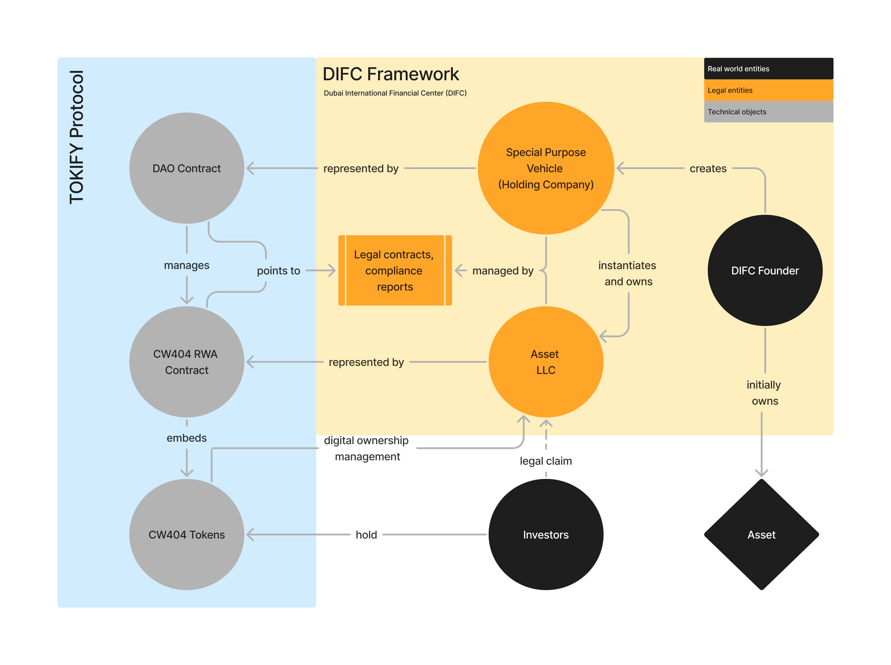
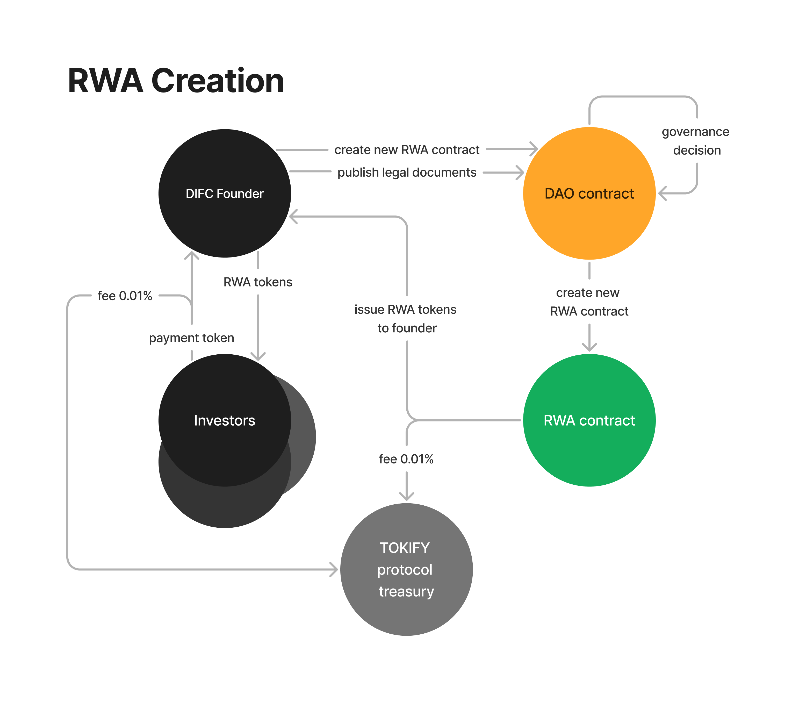
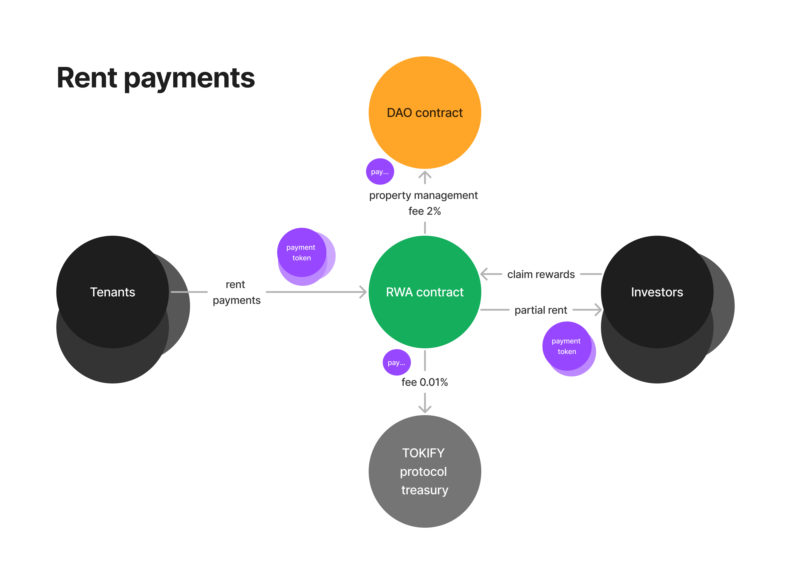

# TOKIFY Protocol
>Tokenize, Invest, Earn

## TL;DR
**TOKIFY Protocol** is a smart contract-based platform on the MANTRA Chain that enables the tokenization of real-world assets (RWAs) through smart contracts and decentralized governance. Asset owners can tokenize physical assets like real estate, allowing fractional ownership and providing investors with liquid, accessible stakes in traditionally illiquid markets.

#### Key Components
1. **Smart Contract-Based Tokenization**: Assets are converted into RWA tokens, representing fractional ownership, enhancing liquidity and accessibility.
2. **Decentralized Governance**: A DAO framework enables transparent governance, with stakeholders voting on asset management and upgrades.
3. **Legal Compliance**: In collaboration with Dubai International Financial Center (DIFC), TOKIFY uses Special Purpose Vehicles (SPVs) to ensure assets comply with local regulations, protecting investor rights.

#### Vision
TOKIFY leverages MANTRA Chain’s smart contracts to democratize access to high-value assets, combining blockchain transparency with robust legal protections to redefine asset ownership in the digital economy.

## Technical Overview

TOKIFY integrates on-chain voting, asset management, and payment processing, enabling decentralized investment and management of RWAs.

1. **DAO Creation**:
   - The **DIFC Founder** initiates the process by creating a DAO via the **TOKIFY Factory**.
   - This step also registers new RWAs in the **DAO Contract (asset registry)**.

2. **Voting and Governance**:
   - The **DAO Contract** connects with a **voting token (CW4)**, enabling DAO members to participate in proposal votes.
   - These proposals are managed by the **vote contract (CW3)**.

3. **Asset Management**:
   - Upon vote approval, the DAO instantiates an **RWA contract (CW404)**.
   - This contract maps the asset to the DAO and allows **investors** to hold RWA tokens, representing their stake in the asset.

4. **Tenant Payments and Rewards**:
   - **Tenants** pay rent using **payment tokens (CW20)** through an **offramp/onramp service**.
   - This service facilitates the conversion between fiat and crypto tokens as needed.
   - Tenant payments are distributed as rewards to **investors** holding RWA tokens.

5. **Reward Claiming**:
   - **Investors** can claim rewards through the system, reinforcing their stake in the DAO and contributing to the asset's ongoing governance and revenue generation.

### TOKIFY Legal Framework Overview
TOKIFY's legal framework ensures that RWAs are digitally represented and managed within the Dubai International Financial Center's (DIFC) regulatory framework, bridging real-world legal entities and blockchain-based governance.

1. **Asset Ownership**:
   - The **DIFC Founder** initially owns the asset, then creates a **Special Purpose Vehicle (SPV)**, a holding company that instantiates and owns the asset through an **Asset LLC**.
   
2. **Management and Representation**:
   - The **Asset LLC** is managed by the SPV and legally represents the asset on the blockchain via the **CW404 RWA Contract**.
   - This contract manages digital ownership and compliance, embedding legal contracts and compliance reports.

3. **DAO Governance**:
   - A **DAO Contract** within the TOKIFY Protocol oversees the RWA contract, linking real-world asset ownership with digital token management.

4. **Investor Participation**:
   - **Investors** hold **CW404 tokens** that represent digital ownership, granting them a legal claim on the asset managed by the Asset LLC.

### Economic Processes

RWAs are digitally represented and managed within the DIFC's regulatory framework, bridging real-world legal entities and blockchain-based governance.

#### RWA Creation
1. **DAO Approval**:
   - A **DAO contract** makes a governance decision to initiate a new RWA, creating an **RWA contract** and publishing necessary legal documents.

2. **Token Issuance**:
   - The **RWA contract** issues RWA tokens to the **DIFC Founder**, representing ownership of the asset.
   
3. **Investor Participation**:
   - **Investors** can purchase RWA tokens using payment tokens, transferring ownership from the DIFC Founder to investors.
   - A transaction fee of 0.01% is applied for each transfer.

4. **Protocol Treasury**:
   - The collected fees (0.01%) from token transactions are allocated to the **TOKIFY protocol treasury** to support platform operations.

#### Rent Payments
Each entity in the ecosystem benefits from a portion of the rent payments, with fees supporting the DAO and the TOKIFY protocol.

1. Tenants pay rent in the form of a payment token to the RWA contract.
2. The RWA contract deducts a 2% property management fee and transfers it to the DAO contract.
3. The RWA contract also deducts a 0.01% fee, which goes to the TOKIFY protocol treasury.
4. The remaining rent is distributed as partial rent to investors, who can then claim rewards.

